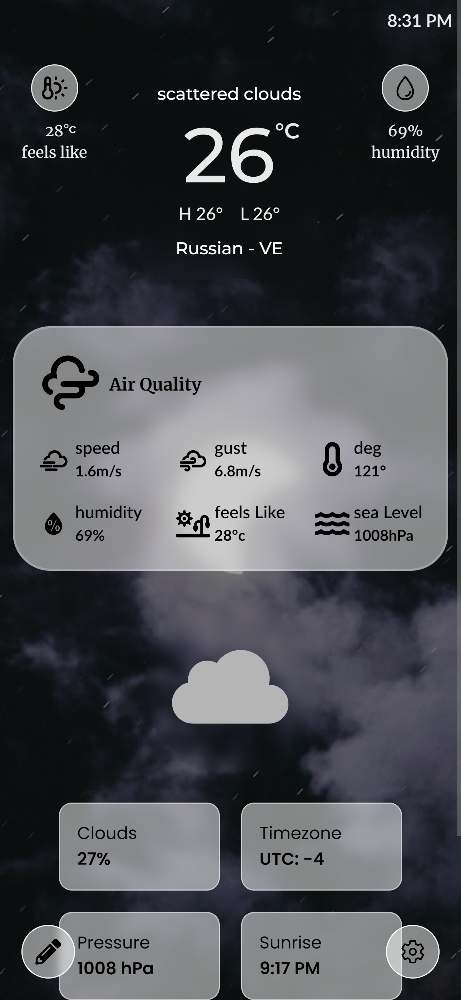

# Cloud canvas
A weather application that shows the current weather information for a locally searched location. Additionally, you can retrieve your current location with a click.

## Screenshots

Mobile
 <div style="display:flex;flex-wrap: wrap;gap:2px">
  
  
 </div>


Desktop
  
  
## Setup 

Follow the intrutions bellow to config and run in your local ambient

### 1.Clone the repository

```bash
git clone https://github.com/yemishi/cloud-canvas.git
```
### 2.Install dependencies

```bash
cd cloud-canvas
npm install
```
### 3.Copy the example environment file 
Copy the '.env.example' file to a new file named '.env':

```bash
cp .env.example .env
```
### 4.Fill in the API keys
Open the '.env' file in a text editor and fill in the necessary API keys with your own values. For example
```bash
API_KEY= "Your openweathermap key"
```
Make sure to replace all fields with your own info

### 5.Run the project
```bash
npm run dev
```
This will start the development server.You can acess the project in your browser at http://localhost:3000.
